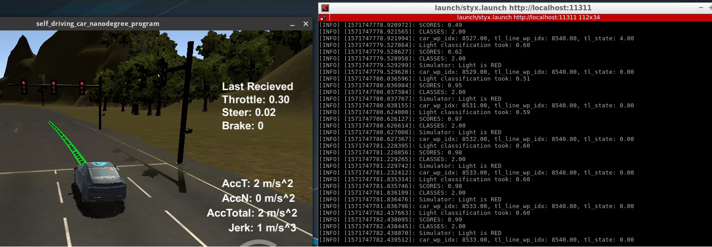
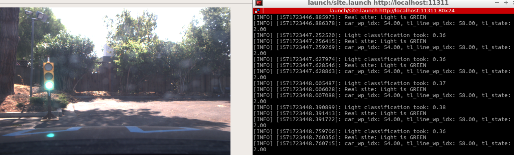
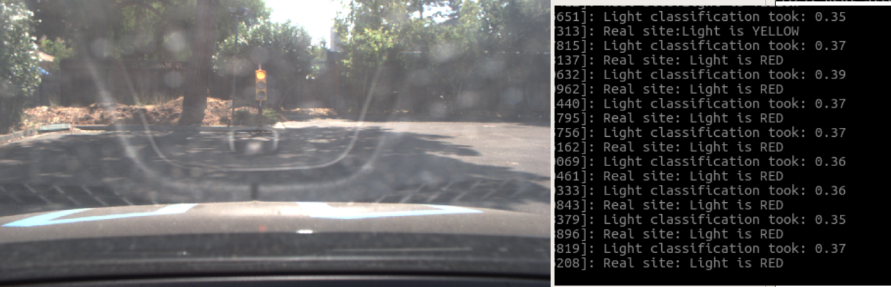

# Self driving car nanodegree

## Capstone project: Programming a real self driving car

This project consist on the integration of different systems in order to drive an autonomous car first on simulation and then on the real world, the real autonomous car is named Carla. Carla will drive on a test track used by Udacity in California, USA.

The software packages are programmed in Python 3 and C++11 using the libraries Scipy, Tensorflow, OpenCV, and others. In order to integrate all software packages, build, debug and run the system the middleware ROS was used, specifically the Kinetic version. For the simulation, the [Udacity system integration simulator](https://github.com/udacity/CarND-Capstone/releases) was used.

This project was done on a group of three people: Jorge Rilling, Martin Sommer and Chia-Hao Huang.

### About the software structure
The system consits on 4 smaller subsystems: Perception subsystem, planning subsystem, control subsystem and hardware (simulator or real car). From the ros perspective the system is built with 7 ros nodes and more than 15 ros topics that make the communication between the nodes. 

The following image ilustrates the subsystems, nodes and the connection between them through topics:

 

#### Control subsystem
This subsystem is the one closer to the hardware and is the one responsible of giving control commands to the car actuators. These commands are the steering angle, the throttle and the brake. It consists on two nodes, the DBW Node written by us in Python and the Waypoint Follower written by [Autoware](https://www.autoware.org/) in C++.

The DBW node uses values of linear speed and angular speed arround the Z axis (the one pointing to the sky) to get the steering angle, throttle and brake needed to make the car follow a given trajectory.

The waypoint follower node receives a list of waypoints with calculated linear and angular velocities that represent a trajectory and with them calculates the needed linear and angular velocities for a given time step. These linear and angular velocities are the ones used by the DBW node.

#### Planning subsystem
This subsystem is the one responsible of defining the trajectory the car will follow on the next cycles. This trajectory is then given to the waypoint follower node of the control subsystem in the form of waypoints. This subsystem consist on two nodes, both written in Python, the waypoint loader node written by Udacity and the waypoint updater node written by us.

The waypoint loader determines all the valid waypoints the car can drive on and send them to be used by the waypoint updater node.

The waypoint updater node determines the trajectory the car will follow on the next cycles using the base waypoints sent by the waypoint loader node. For that it does not only determine which waypoints the car will follow, but also determines the linear and angular velocities the car will need on those points. Then the updated waypoints are sent to the waypoint follower node.

#### Perception subsystem
This subsystem is the one responsible of determining changes on the trajectory based on what the car senses. In the case of this project, the test track on the simulator and the real world site have only a traffic light, so the subsystem consists only on a traffic light detection node which was written by us in Python.

The traffic light detection node uses the base waypoints sent by the waypoint loader node, the current position of the car and an image from a camera attached to the car in order to determine the first waypoint the car will encounter on its trajectory where a red traffic light is located. This information is then used by the waypoint updater node to reduce the speed of the waypoints until it reaches 0 for the waypoint where the stop line for the traffic light is located.

### Traffic Light Detection
The tasks for this package were broken into two parts. In the first part, we need to implement the tl_detector.py module. The walkthrough section gives enough details to implement this module. What is not mentioned in the walkthrough code is the second part, to build a traffic light classifier. Most people used the tensorflow object dection API for this project. There is a very good reference from Alex Lechner at https://github.com/alex-lechner/Traffic-Light-Classification. It gives a detailed tutorial on how to build a traffic light classifier in this project. I followed the same methodoligy to test a couple of pre-trained models in the tensowflow library.

I end up using the SSD Inception V2 model for this project. Two seperate models are trained for simulator and real-world testing. Both models were trained for 20,000 steps.

The performance is good for simullator, here is an example:

Althought the model performs good for simulator, but it didn't perform good enough for real world test. To improve the performance, Gamma correction was used to enhance too bright images.

Here are some examples:

